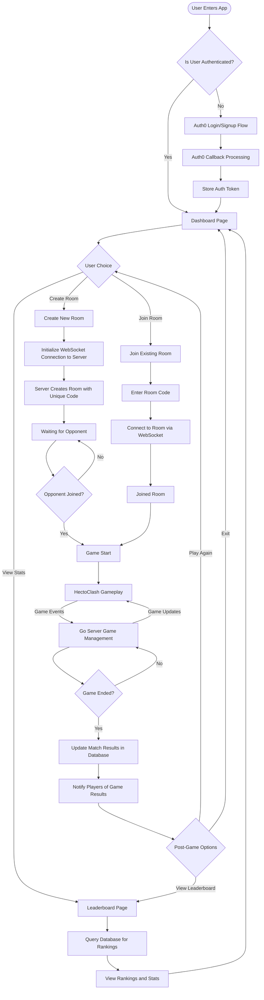

# Hecto-Clash

**Hecto-Clash** is a real-time, multiplayer game platform designed with a modular architecture. It includes separate services for core logic, game state management, and frontend rendering. The platform leverages **Go** for high-performance backend operations and **JavaScript/TypeScript** for a modern, reactive frontend.

---

## 🧠 Project Architecture

```
hecto-clash/
├── client         # Frontend interface (React or similar)
├── core-server    # Matchmaking, validation, and WebSocket notifications (Go)
├── game-server    # Game logic and session management (Go)
├── infra          # Deployment, docker, and infra scripts
```

---

## 🔧 Tech Stack

| Layer        | Technology Used                   | Description                                                                     |
| ------------ | --------------------------------- | ------------------------------------------------------------------------------- |
| Frontend     | React (Vite)                      | Game interface, lobby, and live battle UIs                                      |
| Core Backend | Node.js + Express.js + PostgreSQL | Handles authentication, validation, and room creation                           |
| Game Server  | Go + WebSockets                   | Runs the actual game engine, state sync, puzzle-generation and assignment, etc. |
| Infra        | Docker + Shell Scripts            | Setup, orchestration and deployment scripts                                     |

---

## 🚀 Getting Started

### 1. Clone the repo

```bash
git clone https://github.com/eclairjit/hecto-clash.git
cd hecto-clash
```

### 2. Set up the Client

```bash
cd client
npm install
npm run dev
```

### 3. Set up the Core Server (Node.js)

```bash
cd core-server
npm install
npm run dev
```

### 4. Set up the Game Server (Go)

```bash
cd game-server
./cmd/main.exe
```

> 📝 You may need PostgreSQL running locally or through Docker. Update environment variables as needed in the `.env` files.

---

## 🧪 Features

- ⚔️ Real-time multiplayer gameplay
- 🧩 Hecto-set-based challenges
- 🔄 Matchmaking system with Elo-style ranking (feature in the making)
- 📡 WebSocket powered live interactions
- 🧾 Post-game analytics and leaderboard (feature in the making)
- 🎮 Interactive UI with responsive design

---

## 👥 Team Members

| Name                 | Role                                      |
| -------------------- | ----------------------------------------- |
| Jit Mitra            | WebSocket server and real-time game logic |
| Krish Gujarati       | Ranking algorithm and point system design |
| Ayush Maholiya       | Authentication & player room system       |
| Mukta Tukaram Lokade | Frontend development                      |

---

## 📂 Folder Breakdown

- **`client/`** - React-based frontend using Vite
- **`core-server/`** - Node.js server managing matchmaking, validation, and lobby systems
- **`game-server/`** - Go server handling real-time game execution
- **`infra/`** - Scripts, Docker configs, and other infra-related assets

---

<!--
## 🤝 Contributing

Contributions are welcome! Please:

1. Fork the repository
2. Create a new branch
3. Make your changes
4. Open a Pull Request

--- -->

<!-- ## 📄 License

This project is licensed under the [MIT License](LICENSE). -->

---

## Flow Diagram



## 🌐 Links

- GitHub: [https://github.com/eclairjit/hecto-clash](https://github.com/eclairjit/hecto-clash)
